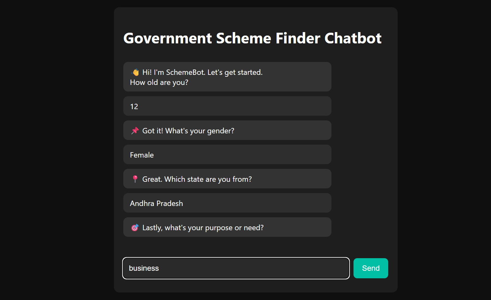
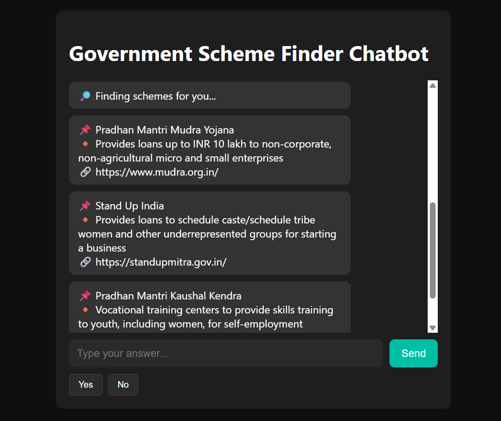

# 🧾 SchemeBot – Government Scheme Finder Chatbot

**SchemeBot** is your intelligent companion for discovering the most relevant Indian government schemes—tailored just for you! With a sleek dark interface, smooth conversational flow, and the power of AI, SchemeBot makes finding government benefits simple, fast, and even fun.

---

## ✨ Key Features

- 🎨 **Modern Dark-Themed UI**  
- 💬 **Conversational, Step-by-Step Interaction**  
- 🧠 **Smart Input Validation**  
- 👤 **Gender & State Selection**  
- 🔁 **Auto Restart**  
- 🤖 **AI-Powered Recommendations**  
- 📦 **Structured JSON Output**  

---

## 🏗️ Tech Stack

| Layer     | Tool/Framework                  |
|-----------|---------------------------------|
| Frontend  | HTML, CSS, Vanilla JavaScript   |
| Backend   | Flask (Python)                  |
| LLM API   | OpenRouter                      |
| Model     | mistralai/mistral-7b-instruct   |

---

## 🚀 Getting Started

1. **Clone the Repository**
    ```bash
    git clone https://github.com/yourusername/schemebot.git
    cd schemebot
    ```

2. **Set Up the Environment**
    - Create a `.env` file in the project root directory.
    - Sign up or log in at [OpenRouter](https://openrouter.ai/) to generate your API token.
    - Add your token to the `.env` file in the following format:
      ```env
      HF_TOKEN="your_openrouter_api_token"
      ```

3. **Run the App**
    ```bash
    python app.py
    ```
    - Open your browser and visit: [http://localhost:5000](http://localhost:5000)

---

## 🗂️ Project Structure

```
schemebot/
├── static/
│   ├── style.css               # Custom UI styles
│   └── screenshots/            # App screenshots
│       ├── image.png
│       └── image2.png
├── templates/
│   └── index.html              # Frontend chatbot interface
├── app.py                      # Flask server logic
```

---

## 📸 Screenshots




---

## 🌐 Usage Flow

1. **Welcome!** The chatbot greets the user.
2. **Step-by-Step Prompts:**
    - Age (must be a number between 1–120)
    - Gender (Male, Female, Other)
    - State (select from 29 Indian states)
    - Purpose (e.g., Education, Business, Healthcare)
3. **AI Recommendation:**  
   User data is sent to the backend, which queries the LLM via OpenRouter.
4. **Results:**  
   Schemes are returned in JSON, parsed, and displayed in a chat format.
5. **Restart Prompt:**  
   After results, the bot asks: _"Want to search again?"_ with Yes/No buttons.

---

## 🤖 Example JSON Output

```json
[
  {
    "name": "Pradhan Mantri Kaushal Vikas Yojana",
    "benefit": "Free skill training for youth",
    "link": "https://www.pmkvyofficial.org"
  },
  {
    "name": "Stand-Up India Scheme",
    "benefit": "Loan support for SC/ST and women entrepreneurs",
    "link": "https://www.standupmitra.in"
  }
]
```

---

## 🤝 Collaboration

If you would like to contribute or collaborate on this project, feel free to fork, open issues, or submit pull requests.  
**If you have questions or want to discuss anything, please don't hesitate to talk to me!**

---

## 📄 License

MIT License — free for personal and commercial use. Modify and share as you wish!

---

> **Note:** This project is not hosted yet. You need to run it locally by following the steps above.
